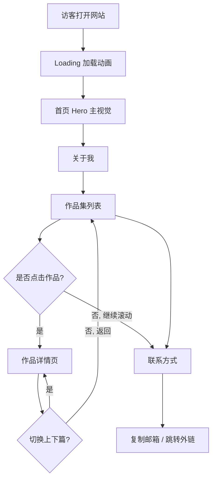

# Old_glasses 个人作品集网站 - 产品需求文档（PRD）

## 1. 产品概述

为独立设计师 @Old_glasses 打造一个专属个人作品集网站，用于集中展示其在动画、UI/UX 体验设计、视频制作、平面设计等领域的代表作品。
- **目标人群**：潜在客户、招聘方、设计同行、创意行业合作伙伴
- **核心价值**：在视觉与交互层面体现设计师的审美与工艺水准，达到"网站本身就是作品"的效果，强化个人品牌识别
- **使用场景**：桌面端浏览器（主）+ 移动端浏览器（副）一键访问，无需注册、零门槛浏览

---

## 2. 核心功能

### 2.1 用户角色
本网站为单向展示型站点，不区分注册角色。

| 角色      | 访问方式  | 核心权限                       |
| ------- | ----- | -------------------------- |
| 访客（默认） | 直接URL | 浏览所有页面、查看作品、下载/复制联系方式、跳转外链 |

### 2.2 功能模块

考虑到信息密度与浏览节奏，采用单页（Single Page Application）+ 锚点滑动 + 二级作品详情页 的结构，共 5 个核心模块（页面）：

1. **首页（Hero）**：动态品牌标识、一句话介绍、向下滚动指引、自定义鼠标跟随效果
2. **关于我（About）**：个人故事、设计理念、关键词卡片、年份时间轴
3. **作品集（Works）**：分类网格 / 轮播 + 视差缩略图、悬停预览动画
4. **作品详情页（Work Detail）**：长图展开、视频播放、文字描述、上一个/下一个导航
5. **联系方式（Contact）**：社交链接、邮箱复制、底部彩蛋动画

### 2.3 页面详情

| 页面名称     | 模块名称           | 功能描述                                                           |
| -------- | -------------- | -------------------------------------------------------------- |
| 首页       | 顶部导航 Header    | 半透明吸顶导航；含 Logo（@Old_glasses）、锚点链接（关于、作品、联系）、深浅色切换按钮、移动端汉堡菜单    |
| 首页       | Hero 主视觉       | 大字号 Display 字体显示 "With Creative From Heart"；文字逐字浮入动画；背景细噪点+渐变层 |
| 首页       | 自定义鼠标          | 桌面端用 SVG 圆点替换原生光标；hover 链接放大、hover 作品卡变文字、点击有涟漪反馈              |
| 首页       | 滚动指引           | 底部小动画（垂直跳动箭头/线条），引导用户向下滚动                                     |
| 关于我      | 个人介绍           | 左侧标题 / 右侧正文双栏；正文为项目背景里的设计师自述，分段呈现                              |
| 关于我      | 关键词标签          | "实用主义""体验设计""创意""猫"等标签卡片，鼠标 hover 时变色 + 微抖动                    |
| 关于我      | 时间线            | 从 2016 到现在，竖向时间线展示重要节点（服务大型互联网公司视觉设计等）                         |
| 作品集      | 分类切换           | 顶部 Tab：全部 / UI&UX / 动画 / 视频 / 平面；切换时作品列表淡入淡出 + 数字滚动            |
| 作品集      | 作品网格           | 不规则非对称布局（错位/不同尺寸）；每个卡片悬停时缩略图缩放、遮罩浮起标题 + 标签                     |
| 作品集      | 视差滚动           | 滚动时每张图按不同速率位移，营造深度感                                            |
| 作品详情页    | 顶部 Banner      | 大图/封面视频自适应；标题、年份、所属分类、客户/合作方信息                                 |
| 作品详情页    | 内容区            | 支持长图、并排双图、视频嵌入、Markdown 文字段落混排                                 |
| 作品详情页    | 上下篇导航          | 底部固定区，鼠标悬停展示下一作品缩略图，点击切换并平滑过渡                                  |
| 联系方式     | 大字号邮箱 / Social | 显示邮箱地址，点击一键复制并提示；展示 Behance/Dribbble/微信/微博等社交图标链接              |
| 联系方式     | 页脚             | 版权信息、ICP（如需要）、滚动到顶按钮                                           |
| 全局       | Loading 加载页    | 首次访问展示进度条 + 品牌字符跳动；不超过 1.5s 自动消失                               |
| 全局       | 滚动进度           | 顶部细线显示页面滚动百分比                                                  |
| 全局       | 暗色/亮色 主题       | 顶部按钮一键切换；本地缓存用户偏好                                              |

---

## 3. 核心流程

### 3.1 浏览流程（自然语言描述）

访客进入网站 → 短暂 Loading → 进入 Hero 主视觉 → 向下滚动 / 通过导航跳转 → 浏览关于我 → 浏览作品集 → 点击感兴趣的作品进入详情页 → 返回或切换上下篇 → 滑到底部查看联系方式 → 点击社交图标或复制邮箱完成联系。

### 3.2 流程图

---

## 4. 用户界面设计

### 4.1 设计风格

参考站点共同特征：克制、优雅、具有微妙动效、强调字体与负空间。综合后定调如下：

- **主色调（亮色主题）**：底色 `#F4F1EC`（暖米白）、主字色 `#111111`（近黑）、强调色 `#FF5722`（炙橙，用于点缀和 hover）、辅色 `#9CA3AF`（中灰）
- **主色调（暗色主题）**：底色 `#0E0E10`、主字色 `#EDEDED`、强调色 `#FFB347`（暖琥珀）
- **字体方案**：
  - **Display 标题字体**：`Fraunces`（带衬线、有性格、可变字重） 或 `Editorial New`
  - **正文字体**：`Inter Tight` 或 `Geist Sans`（克制现代、易读性强）
  - **中文字体**：`Noto Serif SC`（标题）+ `Noto Sans SC`（正文）
- **按钮风格**：圆角 `rounded-full`、底色透明 + 1px 描边；hover 时填充强调色 + 文字反白；伴随轻微缩放与边框流光动画
- **布局风格**：12 栅格 + 不对称构图 + 大量负空间；模块之间使用分隔线或文字大标号（01 / 02 / 03）
- **图标**：使用 `Lucide` 或自绘 SVG，线条粗细统一
- **动画语言**：缓动函数偏向 `cubic-bezier(0.22, 1, 0.36, 1)`（Out Expo），干净有力；时长 0.6–0.9s

### 4.2 各页面 UI 概览

| 页面名称  | 模块名称       | UI 元素描述                                        |
| ----- | ---------- | ---------------------------------------------- |
| 首页    | Hero       | 大号 Display 字、文字逐字浮入、背景渐变 + 噪点、自定义鼠标、滚动箭头微跳    |
| 关于我   | 介绍 + 关键词   | 左标题右正文、关键词标签 hover 闪烁、时间线纵向、滚动到时进度条点亮         |
| 作品集   | 不规则网格      | 卡片错位排布、悬停缩略图缩放并遮罩浮起信息、滚动视差                     |
| 作品详情页 | Banner + 内 | 大封面 + 标题信息块、内容区图文混排、上下篇悬停预览                    |
| 联系方式  | 大字号 CTA    | 巨大的邮箱字符、点击复制 + Toast 反馈、社交图标 hover 旋转/换色、底部小彩蛋 |

### 4.3 响应式设计

- **桌面优先（≥1024px）**：完整动画、视差滚动、自定义鼠标、不规则网格
- **平板（768–1023px）**：网格降为 2 列、保留主要动画、关闭自定义鼠标
- **移动端（<768px）**：单列、汉堡导航、关闭视差与自定义鼠标，使用触屏优化的滑动手势；保留进入动画但适度降级，确保流畅度
- **触屏优化**：所有可点击区域 ≥ 44px、长按预览、滑动切换上下篇

### 4.4 性能与体验目标

- 首屏加载（FCP）< 1.5s（已压缩图片、字体子集化）
- 所有动画 60fps，避免布局抖动
- 图片支持 `WebP/AVIF` 格式与懒加载
- 支持键盘 Tab 导航与基本可访问性（aria-label、焦点可见）
