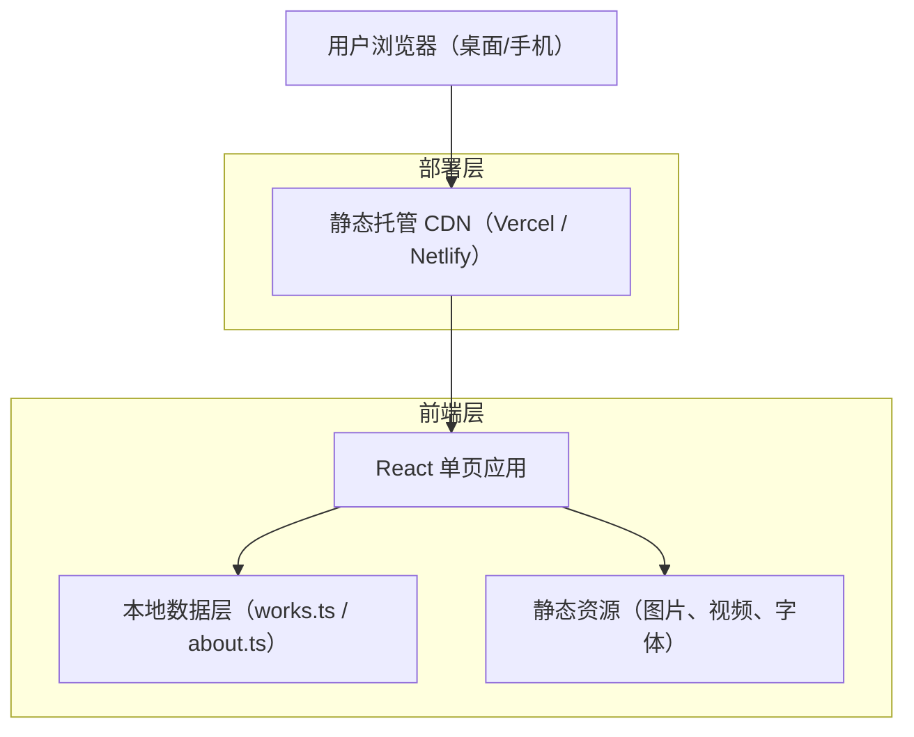

# Old_glasses 个人作品集网站 - 技术架构文档

## 1. 架构设计

由于这是一个纯展示型的个人作品集网站，访客只需"打开浏览器即可看到"，因此采用 **纯前端静态站点** 架构，无需后端、无需数据库。所有作品数据通过本地 JSON / TypeScript 数据文件管理（数据管理层抽象），方便日后维护与扩展。



**核心理念：**
- 数据与视图分离：所有作品信息存放在 `src/data/` 下的 TS 文件中，代码层只负责渲染
- 组件复用：导航、按钮、卡片、动画 wrapper 等抽离为可复用组件
- 状态集中：使用 Zustand 管理全局状态（主题、菜单开关、鼠标位置等）

---

## 2. 技术选型

| 类别       | 技术                                       | 说明                                       |
| -------- | ---------------------------------------- | ---------------------------------------- |
| 前端框架     | **React@18 + TypeScript**                | 组件化、类型安全；TS 对小白长期维护更友好                   |
| 构建工具     | **Vite@5**                               | 启动快、HMR 顺滑                               |
| 初始化工具    | `vite-init`（npm create vite@latest）      | 快速搭脚手架                                   |
| 样式方案     | **Tailwind CSS@3** + CSS Variables       | 原子化样式 + 主题变量，方便切换深浅色                     |
| 路由       | **React Router@6**                       | `/`（首页单页）+ `/works/:slug`（作品详情）          |
| 状态管理     | **Zustand**                              | 轻量、无样板代码；管理主题、菜单、自定义鼠标状态                 |
| 动画库      | **Framer Motion (Motion)** + **GSAP**    | Motion 处理组件级动效；GSAP 处理复杂滚动时间轴 / 视差       |
| 滚动 / 视差  | **Lenis** + ScrollTrigger（GSAP）          | 平滑滚动 + 元素进入动画                            |
| 图标       | **Lucide React**                         | 线条统一                                     |
| 字体加载     | **fontsource / Google Fonts**            | 子集化加载，提速                                 |
| 工具       | ESLint + Prettier + Husky                | 代码规范                                     |
| 部署       | **Vercel**（推荐）/ Netlify / GitHub Pages   | 推送 Git 自动部署，国内访问可加 Cloudflare 或迁移到阿里云 OSS |
| 后端       | **无**（纯静态）                               | 如需联系表单可后期加 Vercel Serverless Function   |
| 数据库      | **无**（mock 在 TS 文件里）                     |                                          |

---

## 3. 路由定义

| 路径               | 用途                  |
| ---------------- | ------------------- |
| `/`              | 首页（含 Hero / About / Works / Contact 锚点） |
| `/works`         | 作品列表完整视图（可选，与首页 Works 区域共用数据） |
| `/works/:slug`   | 单个作品详情页（slug 来自数据文件）   |
| `*`              | 404 页（带返回首页的彩蛋动画）   |

---

## 4. 数据模型（前端 Mock）

虽然没有数据库，仍然设计清晰的数据结构，方便日后接入 CMS（如 Contentful / Notion API）。

### 4.1 数据结构定义（TypeScript）

```ts
// src/data/types.ts
// 作品分类（用常量化管理，避免散落字符串）
export const WORK_CATEGORIES = {
  UIUX: "UI/UX",
  ANIMATION: "Animation",
  VIDEO: "Video",
  GRAPHIC: "Graphic",
} as const;

export type WorkCategory = typeof WORK_CATEGORIES[keyof typeof WORK_CATEGORIES];

// 单个作品
export interface Work {
  slug: string;            // URL 用唯一标识
  title: string;           // 作品标题
  category: WorkCategory;  // 所属分类
  year: number;            // 年份
  client?: string;         // 客户/合作方（可选）
  cover: string;           // 封面图（首页缩略图用）
  thumbAspect: "square" | "portrait" | "landscape"; // 缩略图比例，用于不规则网格
  tags: string[];          // 标签，例如 ["UI", "Mobile"]
  summary: string;         // 一句话简介
  contents: WorkContent[]; // 详情页内容块
}

// 详情页内容块（图文混排）
export type WorkContent =
  | { type: "image"; src: string; alt: string }
  | { type: "image-pair"; left: string; right: string }
  | { type: "video"; src: string; poster?: string }
  | { type: "text"; content: string }; // 段落文本

// 个人信息
export interface ProfileInfo {
  name: string;            // Old_glasses
  slogan: string;          // With Creative From Heart.
  bio: string[];           // 多段自述
  keywords: string[];      // 关键词
  timeline: TimelineItem[];// 时间线
  socials: SocialLink[];   // 社交链接
  email: string;           // 邮箱
}

export interface TimelineItem {
  year: string;            // "2016" / "2020-至今"
  title: string;           // 节点标题
  desc?: string;           // 描述
}

export interface SocialLink {
  label: string;           // "Behance"
  url: string;             // 链接
  icon: string;            // 图标 key
}
```

### 4.2 数据文件组织

```
src/
├── data/
│   ├── types.ts        // 类型定义
│   ├── profile.ts      // 个人信息（about + contact）
│   └── works.ts        // 作品列表（数组）
```

数据访问通过封装的 `useWorks()` / `useProfile()` Hook（数据管理层抽象），后续切换为 API 时，只需改 Hook 内部，组件无需改动。

---

## 5. 项目目录结构

```
OGS_website/
├── public/                  # 静态资源（favicon、og 图）
├── src/
│   ├── assets/              # 图片、视频、字体
│   ├── components/          # 通用组件（Button、Cursor、Magnetic 等）
│   ├── sections/            # 首页各 section（Hero、About、Works、Contact）
│   ├── pages/               # 页面级组件（Home、WorkDetail、NotFound）
│   ├── hooks/               # 自定义 hook（useTheme、useLenis、useCursor）
│   ├── store/               # Zustand 状态
│   ├── data/                # mock 数据（profile、works）
│   ├── styles/              # 全局样式 / 主题变量
│   ├── utils/               # 工具函数（动画、滚动等常量）
│   ├── constants/           # 常量（路由、分类、动画曲线）
│   ├── App.tsx
│   └── main.tsx
├── tailwind.config.ts
├── vite.config.ts
├── tsconfig.json
└── package.json
```

---

## 6. 关键技术细节

### 6.1 平滑滚动 + 视差
- 使用 `Lenis` 接管滚动事件，提供丝滑体感
- 通过 GSAP `ScrollTrigger` 触发元素进入动画与视差位移

### 6.2 自定义鼠标（桌面端）
- 检测设备是否支持 hover（`window.matchMedia('(hover: hover)')`）
- 在 hover 链接 / 作品卡时切换光标形态（放大、变文字、磁吸）

### 6.3 主题切换（亮/暗）
- 使用 CSS 变量 `--bg / --fg / --accent`
- Zustand 持久化用户偏好到 `localStorage`
- 跟随系统：首次访问根据 `prefers-color-scheme`

### 6.4 性能优化
- 图片使用 `loading="lazy"` + `srcSet` + WebP
- 路由级代码分割：`React.lazy` + `Suspense`
- 字体子集化（仅加载用到的字符）
- 视频使用低码率封面图占位 + 点击播放

### 6.5 移动端降级策略
- 关闭：自定义鼠标、视差大幅位移、Lenis 平滑滚动
- 保留：进入动画、过渡、主题切换
- 使用 CSS `@media (hover: none)` 与 `prefers-reduced-motion` 双重判断

---

## 7. 上线与维护

1. **本地开发**：`pnpm install && pnpm dev`，本地访问 `http://localhost:5173`
2. **构建产物**：`pnpm build`，输出到 `dist/`
3. **部署**：将 GitHub 仓库连接 Vercel，每次 push 自动部署，得到 `xxx.vercel.app` 域名；后续可绑定个人域名
4. **新增作品**：仅需在 `src/data/works.ts` 中新增一项 + 上传图片到 `src/assets/works/`，无需改代码
5. **国内访问优化**（可选）：将构建产物部署到阿里云 OSS + CDN 或使用国内的 EdgeOne

---

## 8. 后续可扩展方向

- 接入 CMS（Notion / Contentful / Sanity）做后台编辑
- 添加 i18n（中英双语）
- 增加作品过滤搜索 / 标签云
- 联系表单：Vercel Serverless Function + 邮件服务（Resend）
- 接入 Plausible / Umami 做隐私友好的访问统计
